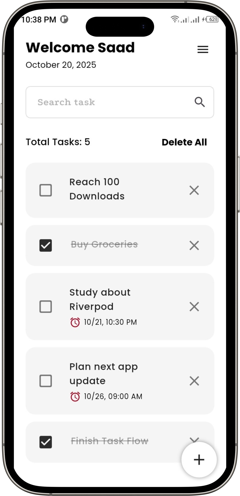
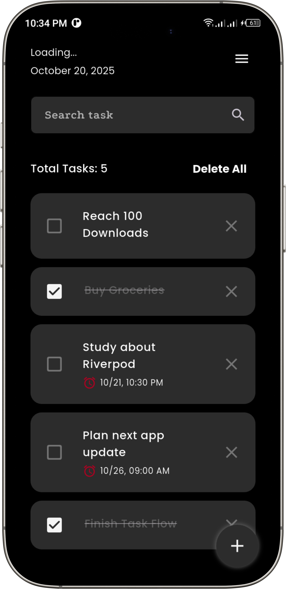
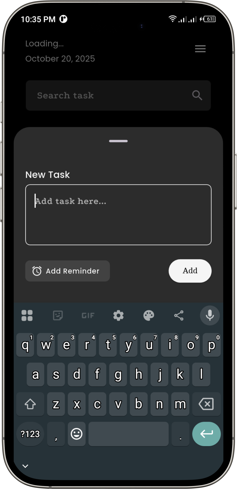
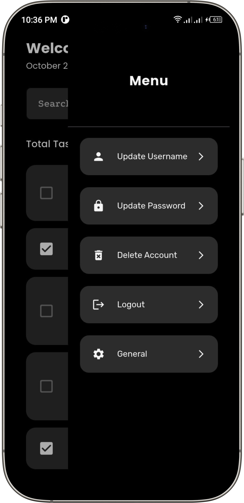

# Task Flow - Smart Task Management App

**From Chaos to Clarity - Stay Organized, Stay Focused.**

Task Flow is a Flutter + Firebase-powered task management app designed to simplify productivity. With seamless task creation, reminders, and real-time cloud sync, it helps you stay in control of your daily goals across devices.

---

## 📱 Screenshots

| Home (Light) | Home (Dark) | Add Task | Drawer |
|---------------|--------------|-----------|---------|
|  |  |  |  |


---

## Features

**Firebase Authentication** - Secure login & signup using email and password.  
**Task CRUD Operations** - Add, edit, delete, and reorder tasks in real-time.  
**Per-User Cloud Sync** - Each user’s tasks are stored under their unique UID in Firestore.  
**Smart Reminders** - Get notified about upcoming tasks via local notifications.  
**Customizable Themes** - Light, Dark, and System modes supported.  
**Offline Support** - Tasks cached locally; auto-syncs when reconnected.  
**Modern UX** - Smooth transitions, Cupertino bottom sheets.  

---

## Tech Stack

| Layer | Technology |
|--------|-------------|
| **Framework** | Flutter |
| **State Management** | Provider |
| **Backend** | Firebase Authentication & Firestore |
| **Local Storage** | Shared Preferences |
| **Notifications** | Flutter Local Notifications + Permission Handler |
| **UI Frameworks** | Google Fonts |
| **Other Packages** | modal_bottom_sheet, intl, permission_handler, provider |

---

## Installation & Setup

### 1️⃣ Prerequisites
- Flutter SDK  
- Firebase project (Firestore + Authentication)  
- Android Studio / VS Code  

### 2️⃣ Clone Repository
```bash
git clone https://github.com/yourusername/task_flow.git
cd task_flow
```

### 3️⃣ Install Dependencies
```bash
flutter pub get
```

### 4️⃣ Setup Firebase
1. Create a Firebase project.  
2. Enable Authentication (Email/Password) and Firestore Database.  
3. Download `google-services.json` and place it in:
  
   ```
   android/app/google-services.json
   ```
5. Add your Firebase configuration in:  
   ```dart
   Firebase.initializeApp(options: DefaultFirebaseOptions.currentPlatform);
   ```

### 5️⃣ Run the App
```bash
flutter run
```

---

## Firestore Security Rules

```js
rules_version = '2';
service cloud.firestore {
  match /databases/{database}/documents {
    match /users/{uid}/tasks/{taskId} {
      allow read, write: if request.auth != null && request.auth.uid == uid;
    }
  }
}
```

These rules ensure users can only access their own tasks.

---

## UI Highlights

- Animated bottom sheets with Cupertino transitions  
- Minimalist drawer navigation  
- Snackbars for all user feedback  
- Custom text fields, buttons, and date/time pickers  
- Smooth light/dark theme switching  

---

## Core Functionalities

| Module | Description |
|--------|-------------|
| **Auth Service** | Handles Firebase login/logout/register |
| **Task Provider** | Manages Firestore task operations |
| **Theme Provider** | Toggles between light/dark/system modes |
| **Notification Service** | Schedules, cancels, and handles reminders |

---

## Testing

Run widget & integration tests:

```bash
flutter test
```

---

## Build Release (Android)

```bash
flutter build apk --release
```

Generated file:  
```
build/app/outputs/flutter-apk/app-release.apk
```

---

## 👨‍💻 Developer

**Muhammad Saad Jamal**  
Flutter Developer | Firebase Enthusiast  
🌐 [Linkedin](https://www.linkedin.com/in/muhammadsaadjamal/)  
✉️ saadj4775@gmail.com  

---

## Future Enhancements

- Task sharing & collaboration  
- Calendar view integration  
- Smart task prioritization using AI  
- Cross-platform desktop & web support  
